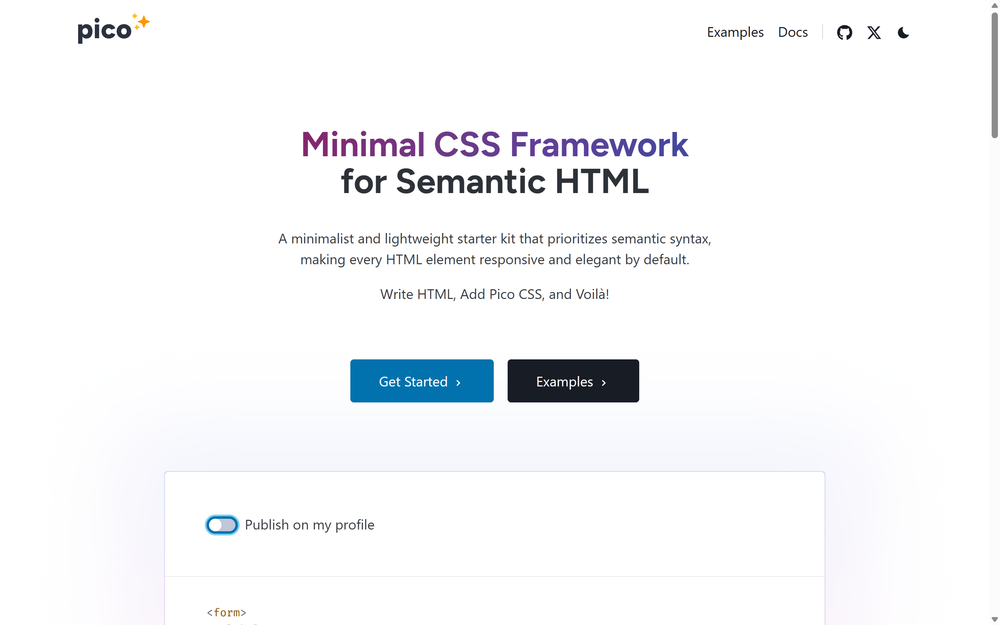
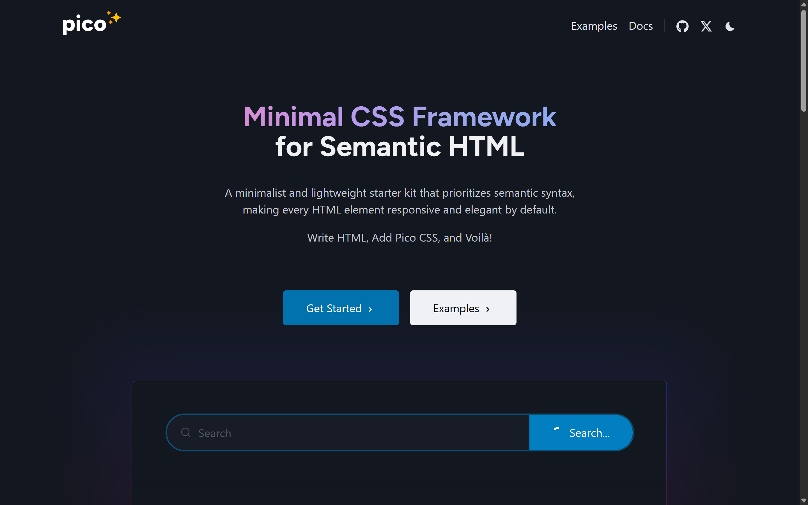
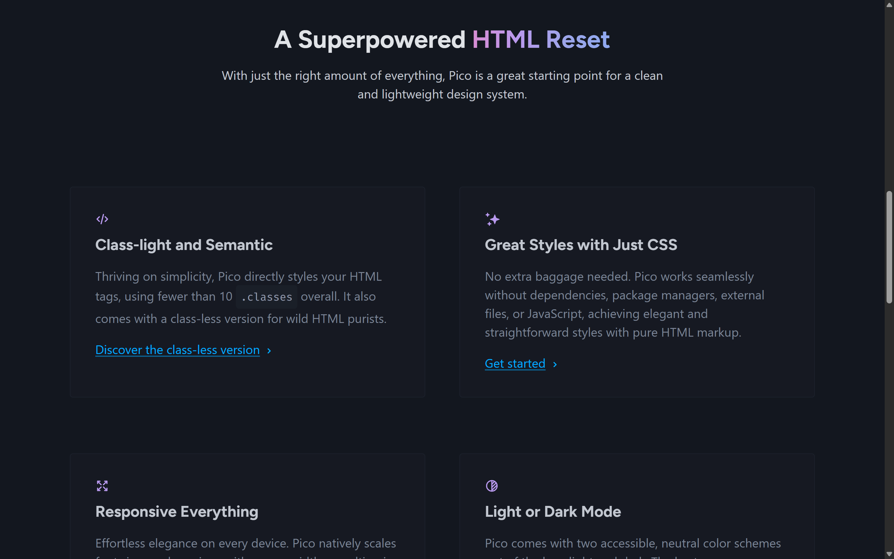
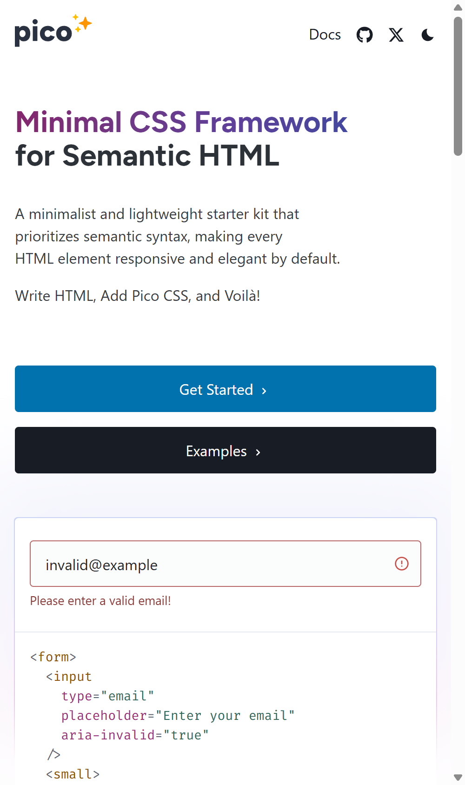

# Pico CSS (picocss.com) — Design System Reference

> Sample extraction produced by **design-system-extractor** from <https://picocss.com/>
> via Chrome DevTools. Pico CSS is an MIT-licensed, open-source framework whose homepage
> *is* a live demonstration of its own design system — an ideal, legally-clean example.
>
> Stack detected: **Pico CSS v2** — a classless/semantic CSS framework driven by
> `--pico-*` CSS custom properties, with native dark/light themes via `prefers-color-scheme`
> / `[data-theme]`. The marketing site layers two webfonts (Figtree, Fira Code) on top of
> Pico's native font stacks.

Screenshots are in `./screenshots/`.

---

## 1. Aesthetic Direction

Calm, neutral, **content-first minimalism** — generous whitespace, a single azure accent,
soft rounded corners, and zero visual noise. The personality comes from typography (a
friendly geometric display face) and a tasteful purple→azure **gradient** on the hero
headline, not from decoration. It is deliberately "quiet": the framework's point is that
semantic HTML looks good with almost no styling.

**The memorable thing:** the gradient hero wordline + the seamless light/dark duality.

**Do NOT:** add heavy borders, hard shadows, saturated multi-color palettes, or tight
spacing. Pico's identity is restraint, neutral grays, one accent, and air.




---

## 2. Color Tokens

Pico ships its palette as `--pico-*` variables that swap per theme. Both themes resolved
live below (hex).

### Dark theme (site default via `prefers-color-scheme`)
| Role | Token | Hex |
|------|-------|-----|
| Background | `--pico-background-color` | `#13171f` |
| Body text | `--pico-color` | `#c2c7d0` |
| H1 / H2 | `--pico-h1-color` / `--pico-h2-color` | `#f0f1f3` / `#e0e3e7` |
| Muted text | `--pico-muted-color` | `#7b8495` |
| Primary (accent) | `--pico-primary` | `#01aaff` |
| Primary hover | `--pico-primary-hover` | `#79c0ff` |
| Primary bg (filled) | `--pico-primary-background` | `#0172ad` |
| Primary inverse | `--pico-primary-inverse` | `#ffffff` |
| Card background | `--pico-card-background-color` | `#161922` |
| Card sectioning bg | `--pico-card-sectioning-background-color` | `#1a1f28` |
| Form element bg | `--pico-form-element-background-color` | `#1c212c` |
| Code background | `--pico-code-background-color` | `#1a1f28` |
| Muted border | `--pico-muted-border-color` | `#202632` |

### Light theme (`[data-theme="light"]`)
| Role | Token | Hex |
|------|-------|-----|
| Background | `--pico-background-color` | `#ffffff` |
| Body text | `--pico-color` | `#373c44` |
| Muted text | `--pico-muted-color` | `#646b79` |
| Primary (accent) | `--pico-primary` | `#0172ad` |
| Primary hover | `--pico-primary-hover` | `#015887` |
| Card / sectioning bg | `--pico-card-…` | `#ffffff` / `#fbfcfc` |
| Form element bg | `--pico-form-element-background-color` | `#fbfcfc` |
| Muted border | `--pico-muted-border-color` | `#e7eaf0` |

> **Design detail worth preserving:** the accent **darkens** in light mode
> (`#01aaff` → `#0172ad`) to keep AA contrast on white. Don't reuse the dark-mode azure
> on a light background.
> Focus ring: `--pico-primary-focus` = `rgba(1, 170, 255, .375)`.

---

## 3. Typography

| Role | Family | Size / line-height | Weight |
|------|--------|--------------------|--------|
| H1 | **Figtree** (site) | 50px / 53px (≈2.5rem) | 700 |
| H2 | Figtree | 40px / 45px (2rem) | 700 |
| H3 | Figtree | 25px / 30px (1.25rem) | 700 |
| Body / nav | system-ui stack | 20px / 30px (1.5) | 400 |
| Code | **Fira Code** | 17.5px | 400 |

- **Root size is `125%`** (≈20px base) with `--pico-line-height: 1.5`.
- **Pico's own defaults are native font stacks** (`system-ui …` for text,
  `ui-monospace …` for code) — zero webfonts out of the box. picocss.com *adds* **Figtree**
  (headings) and **Fira Code** (code) as branding. If reproducing plain Pico, keep the
  system stacks; if reproducing the *site*, load those two fonts.
- A standout Pico feature: **font sizes scale responsively with viewport** at its
  breakpoints — no media-query classes needed.

---

## 4. Layout & Spacing

- **Spacing unit:** `--pico-spacing: 1rem` (used for block + typographic vertical rhythm).
- **Corners:** `--pico-border-radius: .25rem`; interactive elements render ~`5px` (soft,
  never pill or sharp).
- **Container:** Pico's responsive `.container` caps width per breakpoint
  (~510 / 700 / 950 / 1130 / 1530px) and centers content — note the wide side margins in
  the desktop hero.
- **Borders:** hairline, low-contrast (`--pico-muted-border-color`); separation comes from
  spacing and subtle bg shifts, not strong lines.

---

## 5. Components



- **Nav (header):** text links right-aligned (`Examples`, `Docs`, GitHub/X icons) + a
  **dark-mode toggle**; transparent background, 10px padding, `5px` hover radius.
- **Buttons:** two variants seen — **primary** filled azure (`--pico-primary-background`
  `#0172ad`, white text) and a **contrast/secondary** (near-black fill in light mode).
  Padding `15px 20px`, radius `5px`, no border.
- **Forms:** inputs with soft filled backgrounds + hairline borders; **built-in
  validation states** (the hero shows an invalid email with a red message
  "Please enter a valid email!") driven by `aria-invalid`.
- **Switch:** the rounded toggle ("Publish on my profile") uses the accent when on.
- **Cards:** very low-contrast surface over the page bg, hairline border, generous inner
  padding; section headers use the sectioning bg tint.
- **Code blocks:** muted monospace (Fira Code) on the code-bg tint.

---

## 6. Interaction & Motion

- **Focus:** visible ring via `--pico-primary-focus` (translucent azure) — accessibility
  is a first-class concern; don't remove focus outlines.
- **Hover:** accent shifts to `--pico-primary-hover`; buttons/links lighten/darken subtly.
- Motion is minimal and functional (smooth color transitions), matching the calm tone.

---

## 7. Responsive Behavior

| Breakpoint | Behavior |
|------------|----------|
| Mobile (~390px) | Single column; container goes near-full-width with comfortable gutters; **root font-size scales down** so headings stay proportional; nav condenses. |
| Desktop (≥1024px) | Centered container with wide side margins; multi-column feature grid. |



---

## 8. Implementation Notes

- **Framework:** Pico CSS v2 — classless by default; style semantic tags directly.
- **Theming:** define `--pico-*` on `:root` (light) and override under
  `[data-theme="dark"]` / `@media (prefers-color-scheme: dark)`.
- **Fonts to load (site look):** Figtree (headings, 700), Fira Code (code). Plain Pico
  needs none.
- **Icons:** simple inline SVGs (GitHub, X, theme toggle).
- **Globals:** root `125%` font size, `1.5` line-height, `.25rem` radius, `1rem` spacing.

---

## 9. Screenshot Index

| File | Shows |
|------|-------|
| `screenshots/01-hero-dark.png` | Hero in dark mode (site default) |
| `screenshots/02-features-dark.png` | Feature cards / section grid (dark) |
| `screenshots/03-hero-light.png` | Hero in light mode (gradient headline, buttons, form card) |
| `screenshots/04-mobile-light.png` | Mobile (390px) hero, responsive stacking |

### Drop-in token block

```css
:root {                      /* light */
  --bg: #ffffff;
  --fg: #373c44;
  --muted: #646b79;
  --accent: #0172ad;
  --accent-hover: #015887;
  --card-bg: #fbfcfc;
  --border: #e7eaf0;
  --radius: .25rem;
  --spacing: 1rem;
  --font-sans: "Figtree", system-ui, "Segoe UI", Roboto, sans-serif;
  --font-mono: "Fira Code", ui-monospace, SFMono-Regular, Menlo, monospace;
}
[data-theme="dark"] {
  --bg: #13171f;
  --fg: #c2c7d0;
  --muted: #7b8495;
  --accent: #01aaff;
  --accent-hover: #79c0ff;
  --card-bg: #161922;
  --border: #202632;
}
```

---

## Attribution & license

Pico CSS is designed and built by [Lucas Larroche](https://lucaslarroche.com/) and its
[contributors](https://github.com/picocss/pico/graphs/contributors). Pico's **code is
MIT-licensed**; the picocss.com **docs/content are CC BY-SA 4.0**. This reference is an
educational, interoperability-oriented extraction of a public, open-source site and is
included here purely to demonstrate the tool's output.
